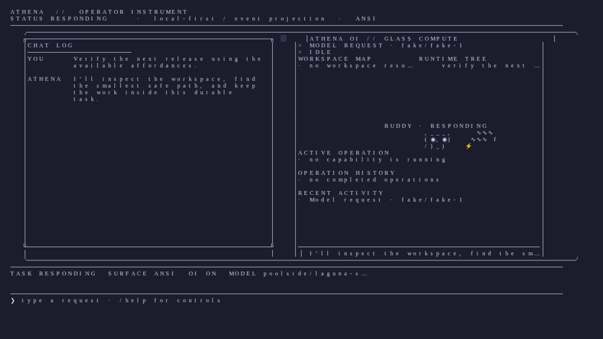

# Athena

A compact, local-first autonomous agent runtime with durable knowledge,
structured delegation, universal execution, a programmable computer body, and
a **single authoritative reasoning loop**.

Athena brings capability discovery, evidence, execution, policy, and learning
into one durable kernel. The normative contracts live in `SPEC.md`,
`BUILDSPEC.md`, `BEHAVIORSPEC.md`, and `RESEARCHSPEC.md`; the architectural
overview is in [`docs/ARCHITECTURE.md`](docs/ARCHITECTURE.md).

> **Status: stable public beta.** The verified release host is Linux; macOS and
> Windows are compatibility targets, and the native X11 frontend remains a
> development preview. Interfaces and subsystem boundaries may still change.

## Why this exists

Athena comes from a simple, long-held ambition: put an agent in an unfamiliar
environment and let it find its footing, construct the missing machinery, and
make useful progress without a manual for every situation.

The interesting part is not any one tool. It is watching a system recognize a
gap, reach for the right affordance, and build a bounded solution that can be
checked and reused. Athena is an attempt to make that behavior durable: one
reasoning loop, explicit authority, retained evidence, and an auditable path
from decision to execution.

This is a stable public beta with a deliberately bounded core: capability
should expand through evidence and disciplined construction, not through an
unbounded collection of loosely coordinated agents.

## Install

Requires Python 3.12 or newer.

```bash
pip install -e ".[dev,cli,glass]"
```

The optional `glass` extra installs Pillow for the hosted raster OI renderer;
ANSI/plain operation does not require it.

## Development

Athena is easiest to work on from an editable install. The repository provides
small, repeatable gates for the main development loop:

```bash
make format          # apply Ruff formatting
make lint            # correctness-focused Ruff checks
make typecheck       # run Mypy
make compile         # catch import and bytecode errors
make check           # run the full local verification gate
```

`make format-check` verifies formatting without changing files. The broader
formatter baseline is being normalized incrementally while the project evolves.

## Quickstart

```bash
athena --help
athena chat

# hosted raster OI on a Kitty-compatible graphics transport
athena --display glass chat

# universal terminal fallback
athena --display ansi chat

# development native Athena terminal (Alacritty core + Athena compositor)
athena native

# inspect the host terminal and renderer decision
athena doctor display

# have Athena prepare a verified candidate for review
athena self "improve the operator diagnostics"
```

`athena self` uses the ordinary task path but forces a speculative workspace
and review-before-commit boundary. Athena verifies the candidate while the
live checkout remains unchanged, then offers Apply, Discard, or Later. Apply
uses the same shadow commit path as other verified work; a failed or stale
candidate cannot be applied.

Inside the console, direct commands use the same policy and execution path as
model-requested commands:

```text
athena> !!pwd       # show and record output, but keep it out of model context
athena> !ls         # show, record, and provide output to the next model turn
```

The CLI includes a deterministic fake provider for offline smoke runs. It is
useful for wiring and UI checks, not general-purpose reasoning. OpenRouter is
the current hosted-provider path:

```bash
export OPENROUTER_API_KEY="<your-key>"
export OPENROUTER_MODEL="poolside/laguna-s-2.1:free"  # optional; free route
athena run "explain the files in this project" --autonomy autonomous
```

Athena keeps the key in its credential boundary and does not write it to the
config, task state, or repository. The default is configured as the free
`poolside/laguna-s-2.1:free` route; availability on shared free capacity can
vary. OpenRouter currently lists that model as a zero-cost, rate-limited free
variant with tool-calling support; availability, terms, and provider behavior
can change. See the [OpenRouter free-variant
documentation](https://openrouter.ai/docs/guides/routing/model-variants/free)
and [current model page](https://openrouter.ai/poolside/laguna-s-2.1-20260720%3Afree)
before using it for sensitive work. Other `:free` model IDs can be selected
with `OPENROUTER_MODEL`. Free-route privacy and training terms are provider
terms, not Athena guarantees; keep secrets out of prompts.

For providers that do not report a per-request cost, configure pricing when a
monetary budget or cost accounting is required:

```toml
[[providers]]
kind = "openai"
name = "main"
base_url = "https://api.example.test/v1"
model = "example/model"

[providers.cost]
per_1m_input = 1.00
per_1m_output = 4.00
currency = "USD"
```

Athena treats pricing as `known free`, `known paid`, or `unknown`; unknown
cost is shown as `cost=unknown` and cannot pass a hard monetary-budget
admission check.

Hosted OpenAI-compatible providers emit Athena's stable `prompt_cache_key` by
default so repeated stable prefixes can use the provider's prompt cache.
Known local presets (`ollama`, `lmstudio`, `vllm`, and `llamacpp`) remain opt-out
because they do not promise that extension. For a custom OpenAI-compatible
server that rejects the field, disable it explicitly:

```toml
[[providers]]
kind = "openai-compat"
name = "custom"
base_url = "https://api.example.test/v1"
model = "example/model"
cache_mode = "none"
```

Cache routing is shared across sessions inside the configured cache namespace
and includes the model, provider profile, and rendered stable-prefix identity.
Set `cache_namespace` to a distinct authenticated user or tenant value when a
service process serves more than one principal; the value is hashed before it
reaches a provider. Task- or session-specific context stays outside the shared
stable prefix.

“Maximum prompt-cache reuse” means that this stable prefix remains byte-stable:
system instructions, policy context, tool schemas, ordering, model, and provider
profile are all part of the cache identity. Athena records cache reads, writes,
and uncached input separately, so reported prompt totals and costs remain correct
when a provider returns cache subdivisions. Reuse is still bounded by the
provider’s cache lifetime and invalidated when any tracked prefix component
changes; it is not an infinite local prompt store.

### Hermes Agent self-host referee

Athena can send one bounded review packet at the candidate and mission
boundaries to a local Hermes Agent profile. Hermes is advisory only: Athena's
deterministic proof remains authoritative, and human promotion is always
required.

Enable it once with the operator config command:

```bash
athena config set hermes-referee.enabled true
athena config set hermes-referee.endpoint http://127.0.0.1:8642
athena config set hermes-referee.profile athena-referee
athena self status
```

The Hermes host should expose the named profile through its API-server
multiplexing with its explicit referee mode enabled (`enabled: true`,
`policy_version: 1`). Referee mode is a hard no-tools boundary: the profile
must advertise `runtime.mode = "referee"`,
`runtime.tool_execution = "disabled"`, and `effective_tools = []`; later MCP
refreshes must not reintroduce tools. Athena does not grant Hermes any
mutation authority; the profile hardening is an operator-owned Hermes setting.

The equivalent TOML is:

```toml
[hermes_referee]
enabled = true
endpoint = "http://127.0.0.1:8642"
profile = "athena-referee"
timeout_seconds = 60
# allow_remote = true                 # required for a non-loopback endpoint
# allow_insecure_remote = true        # development-only HTTP exception
# credential_id = "HERMES_API_KEY"  # optional managed secret name
```

Before review, Athena performs a cached safety preflight against
`/v1/models` and `/v1/capabilities`. The selected profile must advertise
`runtime.mode = "referee"`, `runtime.tool_execution = "disabled"`, referee
policy version `1`, and `effective_tools = []`. A successful status shows
`Hermes referee CONNECTED` and `Hermes safety READ-ONLY VERIFIED`; unsafe
profiles are reported as `UNSAFE PROFILE`. Loopback endpoints are allowed by
default; remote endpoints require explicit opt-in and HTTPS unless the
development-only insecure override is enabled. `athena self status` distinguishes
disconnected, connected-but-unsafe, and safety-verified states.

Hermes is called at semantic review checkpoints, not for every tool or model
event. Its profile should be read-only, low-temperature, and free of mutation
tools. A transport failure or malformed response produces a hold; it cannot
apply, promote, or write Athena changes.

For an opt-in live transport check, set `ATHENA_HERMES_E2E_ENDPOINT` (and,
when required, `ATHENA_HERMES_E2E_API_KEY`) and run
`uv run --frozen --no-sync pytest -q tests/e2e/test_hermes_agent.py`.

## Architecture at a glance

- `athena.kernel` — the one reasoning loop (INV-001).
- `athena.affordances` — the effective surface of native, generated, external,
  task-local, and project-scoped abilities.
- `athena.capabilities` — `Registry -> Policy -> Executor`, the one capability path (INV-004).
- `athena.workflows` — durable declarative composition; workflows do not create
  another reasoning loop.
- `athena.research` — durable source snapshots, evidence objects, claim links,
  and research gaps; acquisition remains explicitly policy-controlled.
- `athena.execution` — the one execution authority (INV-005).
- `athena.state` — the one session authority (INV-003).
- `athena.tasks` — the one task abstraction (INV-002).
- `athena.policy` — unbypassable policy + autonomy profiles (INV-008).
- `athena.scheduler` — durable trigger + claim engine; fires due occurrences and
  enqueues Tasks without creating a second reasoning loop.
- `athena.shadow` — speculative execution in isolated branch clones of the ONE
  agent; nothing runs outside the canonical kernel/policy/executor path.
- `athena.causal` — causal task forks from any event point, plus checkpoint
  support so a fork can restore to an exact causal state rather than replay.
- `athena.worldstate` — durable claims, invariants, and execution-grounded
  task reality.
- `athena.fusion` — orchestrates shadow + worldstate + causal + synthesis as
  ONE system: speculative experiments, invariant-gated commits, claim
  invalidation on commit, proof-carrying synthesis.
- `athena.interpreter` — the single-routing authority that proposes/adapts
  machinery through the canonical path.
- `athena.recovery` — startup crash recovery: reconciles in-flight state after
  a hard crash.
- `athena.{context,memory,skills,models,mcp,acp}` — supporting subsystems.
- `athena.service` — composes the runtime; `athena.{cli,api}` — interfaces (INV-007).

## Operating model

Athena is intended to feel as operationally useful as a broad computer-use
agent while remaining one durable intelligence internally:

```text
                         AgentKernel
                              │
                              ▼
                       Affordance Fabric
          capabilities │ workflows │ skills │ evidence
                              │
                              ▼
                 policy, approvals, budgets, scopes
                              │
                              ▼
                    Programmable computer body
       execute │ runtimes │ PTY │ files │ processes │ network │ devices
                              │
                              ▼
                         Durable reality
       tasks │ events │ artifacts │ mutations │ claims │ provenance
```

The Fabric is deliberately broader than a static tool registry. It combines
native, generated, external, task-local, project, and user-scoped affordances.
The kernel can use an existing capability, compose a workflow, acquire missing
knowledge, or construct deterministic machinery when the current surface is
insufficient. Workflows and capabilities act; only the `AgentKernel` decides
what to do next.

The design carries forward three complementary lines of work:

- **Open Interpreter Classic:** a programmable, persistent, introspectable
  computer where code can fill a missing intermediate capability.
- **Machinist:** a disciplined construction pipeline of specification,
  implementation, independent checks, contract tests, provenance, and explicit
  promotion.
- **Archivist:** an evidence pipeline for policy-controlled acquisition, source
  snapshots, claims, citations, contradiction analysis, and retention.

These are expressed as ordinary capabilities, workflows, artifacts, evidence,
and events under the same policy and execution boundaries. They are design
influences and supporting concepts, not additional reasoning loops inside
Athena.

## Fused execution model

The kernel stays the single reasoning authority, but it composes a family of
durable, auditable mechanisms that all live inside the same event log and the
same kernel/policy/executor path:

```text
       ShadowEngine — speculative execution in isolated branch clones
       TaskWorldState — claims + evidence + invariants + machine reality
       TaskForker — causal forks from any event point (checkpoint-aware)
       CheckpointManager — workspace snapshots
       SynthesisEngine — ephemeral capabilities -> proof-carrying skills
                              │
                    Fusion orchestrator
                              │
                 proposals, invariant-gated commits,
                 claim invalidation, proof-carrying synthesis
                              │
                    AgentKernel (decides what happens next)
```

Typical integrated workflows:

- **Speculative experiments** — propose operations, execute in a shadow branch,
  verify, record a claim bound to the evidence, check invariants before commit,
  and commit only when the envelope holds. If the experiment fails, fork the
  parent task from the pre-experiment event for an alternate approach.
- **Comparative experiments** — run bounded alternatives from the same
  unchanged workspace, verify each independently, and return comparable proof
  without mutating reality; the kernel chooses what to commit.
- **Invariant-gated commits** — no shadow branch commits while a required
  invariant is violated; violations are recorded as world-state facts.
- **Claim invalidation on commit** — committing a branch staleness-invalidates
  every claim whose dependency paths overlap the committed files.
- **Proof-carrying synthesis** — synthetic capabilities validated in shadow
  branches carry their branch id as provenance; repeated success converts them
  to skill candidates with that evidence attached.
- **Fork-with-checkpoint** — forking can first capture a parent-workspace
  checkpoint so the fork restores to the exact causal state rather than merely
  replaying events.
- **Checkpoint lifecycle** — task-owned checkpoints can be inspected and
  released through `fusion`; branch, claim, and recovery owners keep evidence
  alive until their lifecycle is complete.

Durably scheduled work is the same idea applied to time. `athena.scheduler` is
a trigger + claim engine that fires due occurrences and enqueues Tasks; it
*creates Tasks only* and never runs an agent loop, so scheduling never becomes
a second reasoning brain.

Startup is reconciled through `athena.recovery`, which transitions in-flight
state left behind by a hard crash back to a consistent surface before the
kernel resumes.

## Adaptive affordances

Athena has several intentionally distinct ways to extend its operating
surface:

```text
Scratch computation
    cheap, task-local helper; no automatic retention

Generated capability
    validated callable machinery with a schema and provenance

Workflow
    deterministic composition of capabilities and nested workflows

Skill
    procedural knowledge that helps the kernel choose an approach

Evidence / research
    durable support for factual claims and decisions
```

The generated-machinery lifecycle is scoped, durable, and explicit:

```text
SCRATCH → TASK → CANDIDATE → PROJECT → USER → SYSTEM
```

Task-local machinery is visible only to its owning Task and is removed at
terminal cleanup. Repeatedly successful task machinery can be retained as a
durable, reviewable candidate with validation proof, dependency fingerprint,
usage history, and lifecycle records. Project and user promotion are separate
operations. System promotion is a normal release concern, never autonomous
self-modification.

Generated code expands behavior, not authority. A model-declared effect list
is audit metadata, not permission. Effective authority is calculated outside
the generated code and enforced by the canonical capability/policy/execution
path. Source validation, JSON Schema contract checks, bounded tests, and
restricted execution are independent admission requirements; a repaired tool
call is not evidence that the implementation is safe.

Generated code may compose governed native capabilities through the mediated
`athena.call(capability_id, arguments)` host API. The generated process never
receives a dispatcher or filesystem handle; each host request returns through
the canonical schema, policy, approval, RealityGate, budget, and mutation
path. If a generated tool later encounters stale provenance, environment
drift, or an output-contract mismatch, the result carries a bounded repair
signal. A synthesis request may declare `required_capabilities` when a
host-call branch is not exercised by its fixtures; observed host calls are
added to that same bounded set during validation. It never auto-rewrites or
auto-promotes itself.

### Generated-code quality and dynamic contracts

Generated machinery is admitted through a deterministic quality gate before it
becomes callable:

```text
source
  -> parse/interface checks
  -> security-pattern checks
  -> canonical formatting (Ruff when available)
  -> lint (Ruff)
  -> typecheck for durable scopes (Mypy)
  -> exact JSON Schema compilation
  -> bounded fixture/smoke execution in the restricted backend
  -> task/project overlay registration
```

The input contract may be supplied explicitly or generated from positive
validation fixtures. If an output contract is omitted, successful fixture
observations produce a concrete output schema. Both contracts are compiled
and revalidated at the same boundary used for ordinary tool calls, so a
generated helper cannot quietly fall back to an unconstrained `{}` contract.

Tool repair is the adjacent, narrower gate for model-produced calls. It keeps
raw malformed arguments, applies one deterministic schema-directed repair
pass, records a receipt, and strictly revalidates the result. It may correct a
bad call shape; it never formats, tests, or certifies the generated
implementation behind that call. Those concerns remain separate and both
must pass before generated machinery is retained or promoted.

The repository exposes the same discipline as repeatable developer gates:
`make format` applies Ruff formatting, `make lint` checks correctness-focused
Ruff rules, `make typecheck` runs Mypy, `make compile` catches import/bytecode
syntax failures, and `make check` runs those static gates plus the highest-risk
generated-machinery and model/tool contract tests. The broader formatter check
is available as `make format-check`; existing legacy formatting is being
normalized incrementally rather than hidden behind a false clean claim.

## Demo (work in progress)

The offline Capability Fabric showcase is reproducible with VHS and uses the
same projection and instrument surface that power `athena chat` and
`athena run`. It is a development preview—not a product video—and is expected
to change while the chassis, CRT scene, animation, and pacing are refined:



The canonical fixture is `demos/fixtures/capability_fabric.jsonl`. It is
replayed through the real CLI surface. The intended task flow is to discover a
missing affordance, bind local evidence, synthesize and validate a task-local
helper, repair a malformed call, request approval, execute under inherited
authority, and retain the result.

Always render through the single-writer wrapper so the artifact lifecycle
is race-free and process-exit is verified before the gif is treated as
complete:

```bash
scripts/render-demo              # renders the current default recording
scripts/render-demo capability_fabric
```

The wrapper acquires an exclusive lock, renders to a unique temp path,
verifies VHS exit 0 and that the resulting GIF decodes (GIF89a magic,
1280x720, frame count, bounded duration), and atomically renames the temp
into place. A bounded timeout kills the whole VHS process group on overrun and
leaves any previous known-good GIF untouched. Rendering requires `vhs` and
`ffmpeg` on `PATH`; non-interactive rendering also uses `tmux` to provide VHS
a correctly sized PTY.

Direct `vhs demos/capability_fabric.tape` still works for ad-hoc local
capture but does not provide the lock, timeout, or decode validation used by
the optional demo wrapper.

### Optional host-terminal compatibility smoke test

The Termux script is an optional ANSI/PTY compatibility probe, not an
Athena stable-beta support target or release gate. Athena's supported terminal
surfaces are hosted Glass over Kitty Graphics Protocol (Kitty and WezTerm),
the ANSI fallback, and the native Alacritty-core development frontend. From a
checkout, run the optional probe manually:

```bash
scripts/termux-smoke
```

It launches the fixture-backed demo in a 160×45 pseudo-terminal and checks
that the conversation well, OI scene, workspace map, runtime tree, and Buddy
all render before the process exits. To exercise an installed CLI instead,
use `ATHENA_SMOKE_MODE=cli ATHENA_BIN=athena scripts/termux-smoke`; that path
uses a temporary database/workspace and never inherits OpenRouter credentials.

For a quick local preview, pass a higher speed multiplier to the driver:

```bash
.venv/bin/python demos/capability_fabric_demo.py \
  --replay demos/fixtures/capability_fabric.jsonl --speed 8
```

The demo uses real Athena protocol, validation, event, and operator-surface
primitives but no model provider, network, database, or host mutation.

Research uses the same durable Task and evidence model. A source is fetched
only after passing source/network policy, retained as an artifact-backed
snapshot, and linked to claims through locators and supporting excerpts.
Bounded lexical search, snapshot indexing, evidence verification, gap
tracking, and the deterministic `research:plan`, `research:assess`,
`research:bundle`, and `research:run` operations are live. `research:run`
composes an explicit objective, requirements, selected source captures, exact
evidence excerpts, contradiction checks, and a final readiness bundle without
creating a separate research brain. Open-ended retrieval, semantic ranking,
and autonomous research planning remain in development.

## Current limitations

Athena is not a giant predefined-tool agent, a collection of independently
reasoning subagents, or a claim that every present backend is production-ready.
The architecture document records the current alignment boundary. In
particular, full host isolation, process reattachment after restart, semantic
research/indexing, the native terminal frontend, and some specialized
runtime/UI backends remain active implementation work. A restart deliberately
marks in-process runtime sessions lost and emits `RuntimeStateLost`; Athena
does not guess that an old process is still safe to reuse. Types, registries,
and documentation are not by themselves evidence that a subsystem is complete.

## Operator surface

`athena chat` and `athena run` use a calm operator surface over Athena's
durable task events. The two apertures are equal in logical size: the left is
the readable `YOU`/`ATHENA` conversation well, and the right is the OI scene
viewport. The buddy is an entity inside that viewport, never a permanent
sidebar that steals OI content width. Approval, history, live stream, runtime
trees, failures, recovery, and delegated work are projections of the same
canonical events.

The current hosted Glass path renders the right CRT as a bounded Pillow
framebuffer and presents it through the Kitty Graphics Protocol. Kitty and
WezTerm are the primary supported hosts for this path; Athena probes the
active TTY and falls back safely when graphics support is not confirmed.
`ATHENA_KITTY_CONFIRMED=1` may be used in a controlled launcher when probing
is unavailable. ANSI is the safe default/fallback and keeps the same scene
semantics in cell text. The native Athena terminal development slice is documented in
[`docs/NATIVE_TERMINAL_FRONTEND.md`](docs/NATIVE_TERMINAL_FRONTEND.md); it is
separate from the Python package and is not yet the default shipped frontend.
`athena native` launches that frontend with a Python service session inside
its PTY and a Unix-socket projection bridge; build the native binary first with
`cargo build --manifest-path native/Cargo.toml --offline`.
Noisy deltas are coalesced, animation is presentation-only, and reduced motion
is available with `ATHENA_REDUCED_MOTION=1` or `--reduced-motion`.

`athena inspect TASK_ID` is a deep task-observability command that surfaces
durable provider/model usage rows and task activity for a given task.
`athena oi-stream` opens the live OI window as a full-pane first-class view:
the same bounded OI scene used by the dual-pane surface, with an unbuffered
model/runtime stream, an in-scene Buddy, and inline approvals.

### Stable views (REPL meta-commands)

| Command | What it shows |
|---|---|
| `/permissions` | Active policy grants (scope, capability, expiry) and pending approvals. |
| `/diff [N]` | The last N file mutations from the write-ahead mutation ledger. |
| `/undo MUTATION` | Roll back one completed mutation via `RollbackExecutor`. |
| `/compact` | Context-window size, output reserve, and recent-verbatim-turn settings. |
| `/criteria LIST` | Set acceptance criteria for the next task (`;`-separated; `command:` prefix = probe). |
| `/interrupted`, `/resume [ID]` | List/re-queue tasks parked by shutdown or crash. |
| `/context` | What the next model turn will see (durable messages + inclusion rules). |
| `/details` | Expand or collapse the compact reasoning/status treatment. |
| `/scroll left|right up|down|bottom` | Inspect retained conversation or OI history without losing the live tail. |
| `/mascot [NAME]` | Select `owl`, `cat`, `bot`, a configured character, or `off`. |
| `/cancel`, `/sessions`, `/new`, `/autonomy`, `/model` | Task/session control. |

> **Note:** `CheckpointManager` snapshots are **workspace-file snapshots**
> (files + manifest). They do not yet capture runtime variables, processes,
> database state, or environment — that fuller "computational checkpoint" is
> future work. The `workspace.snapshot/restore` capability carries the same
> scope.

Every view is a projection of the same canonical stores the kernel reads
(`ApprovalStore`, `MutationStore`, `MessageStore`, artifact store); none of
them mutate state except `/undo`, which goes through the service.

### Direct execution: `!` vs `!!`

Both escapes run shell commands through the canonical
`registry -> policy -> executor` path — policy, approval, recording, and
artifacts apply exactly as for model-requested execution. They differ only in
context handling:

- `!cmd` — result is recorded in the session transcript AND injected into the
  next model turn.
- `!!cmd` — result is recorded for audit but excluded from model context
  (`inject_into_context=False`; filtered at the context compiler boundary).

Neither escape routes through model inference. Both belong to the current
durable session and appear in `/sessions`, `/diff`, and the audit trail.

### Role-divided models

Different roles can use different models. Roles without an assignment fall
back to whatever the user configured globally (the "primary" choice):

```toml
# athena.toml (or ATHENA_MODEL_ROLES='{"summarizer":{"allowed":["prov/cheap"]}}')
[model_roles.summarizer]
allowed = ["openai/gpt-4o-mini"]     # cheap model for context compression
max_cost_usd = 0.01

[model_roles.judge]
allowed = ["anthropic/claude-sonnet-4"]   # acceptance-criteria judging

[model_roles.primary]
allowed = ["anthropic/claude-opus-4"]     # main reasoning loop
```

Built-in roles: `primary` (task reasoning), `summarizer` (context compression),
`judge` (model-judged acceptance criteria). A caller's explicit allowlist
always wins over role defaults.

### Post-task knowledge pipeline

Every completed or partial task feeds Athena's durable knowledge: an episodic
record of the task outcome is saved immediately, conservative lesson
candidates are stored as `pending_promotion` (never auto-trusted), and skill
drafts are validated and recorded for explicit promotion later (BHV-099/102/107).

### Acceptance criteria

```bash
athena run "fix the failing test" --criteria "command:pytest -q;no TODO left in src"
```

`command:` criteria run as executable probes; the rest are judged by the
`judge`-role model against task evidence. Claimed completion with unverified
criteria resolves to PARTIAL with the unresolved items recorded — never a
false COMPLETE.

### Resume after crash/shutdown

```text
/interrupted          # list tasks parked by shutdown or crash
/resume [task_id]     # re-queue the original durable task (same objective,
                      # criteria, workspace, policy) — not a new conversation
```

Example:

```
$ athena chat
> !!ls -la            # look around without polluting model context
┌─ execute ──────────────────────────────
│ language: shell
│ code: ls -la
└──────────────────────────────────────
  direct command · displayed only
  ✓ execute completed

> !cat notes.md       # this output IS available to the next turn
> fix the bug described in notes.md   # model sees the `!` output above
┌─ approval required ────────────────────
│ capability: execute
│ choose authorization scope:
│   1) call
│   2) task
│   3) session
│   d) deny
└──────────────────────────────────────
approval [1-3 / d] 2
```

---

## Infrastructure support and disclosure

> **Athena would not have reached its current state without the services of
> [FreeInference.org](https://freeinference.org/).**

This project was built and validated using model-inference access provided by
FreeInference.org, which makes free inference available to the public. That
access made it possible to develop and validate capable systems without the
hardware or budget that would otherwise be required.

For clarity and full disclosure:

- **FreeInference did not commission, direct, review, or pay for this work.**
  This is not a sponsored contribution, an endorsement by FreeInference, or a
  statement on their behalf. They are neither a partner nor a backer of Athena.
- This acknowledgment is offered freely and out of gratitude, not obligation.
  Open access to capable inference infrastructure is a meaningful enabler for
  open-source developers and researchers.

Free public inference is a valuable and vital societal resource worth
sustaining. If you or your organization can provide GPU capacity, hardware,
cloud credits, research funding, or other infrastructure support, please
consider supporting FreeInference so it can continue serving open-source
development, research, and education.
